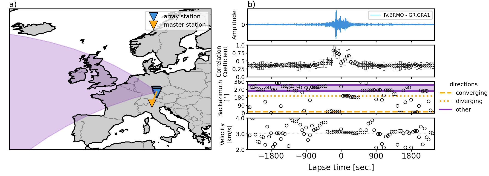

# Repeating direct waves in the coda of ambient seismic noise cross correlations

[](https://zenodo.org/badge/latestdoi/601300942) 



This repository contains all data products, metadata, and code necessary to reproduce all figures of the manuscript "Repeating direct waves in the coda of ambient seismic noise cross correlations" by Schippkus et al. (2023), to be submitted for review.

[NYI] `\manuscript` contains the pre-print pdf. Also available (and citable!) on EarthArXiv [soon].

`\notebooks` contains three notebooks: `fig3_repeating_impulsive_source.ipynb` reproduces Figure 3, `fig5_secondary_microseism_stf.ipynb` reproduces Figure 5, and `figs.ipynb` reproduces all other figures. Please read the instructions in the first cell of `figs.ipynb` carefully. `settings.toml` describes the parameters used for each figure. `schippkus_2023_lib.py` contains much of the logic for computing waveforms, cross-correlating them, and beamforming the cross correlations.

`\correlations` contains all cross-correlation functions our measurements are based on. These are computed from 2 years of continuous data in 2019 & 2020 between master stations `IV.BRMO` & `PL.OJC` and the Gräfenberg array `GR.GR*`.

`\figures` contains all figures as produced by the notebooks provided.

## Requirements

To run these notebooks, the following is required

* Python >= 3.11
* Scientific Python stack (scipy, matplotlib, numpy)
* obspy
* cartopy
* tqdm
* pygc (for easy great-circle computations)
* notebook

A functioning installation can be achieved, e.g., via conda by

```bash
>> conda create -n schippkus_et_al_2023 python=3.11
>> conda activate schippkus_et_al_2023
>> conda install -c conda-forge obspy cartopy tqdm pygc notebook
```
